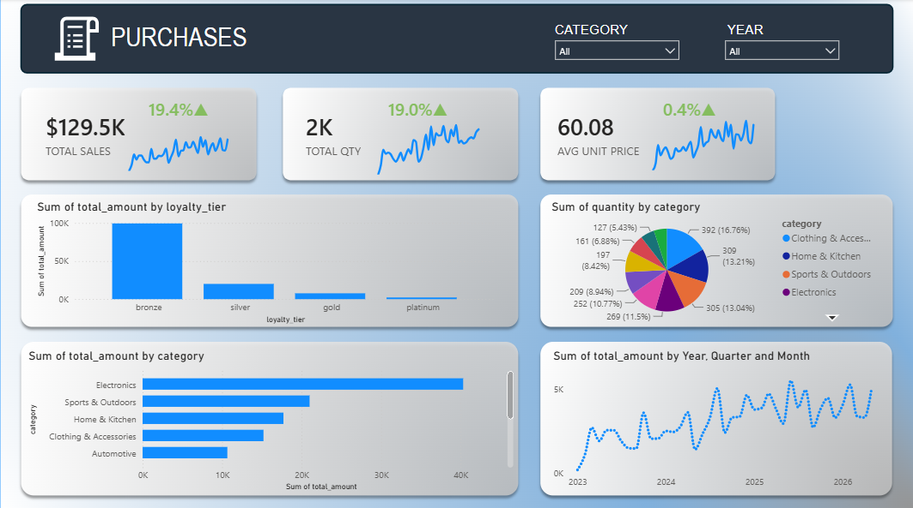
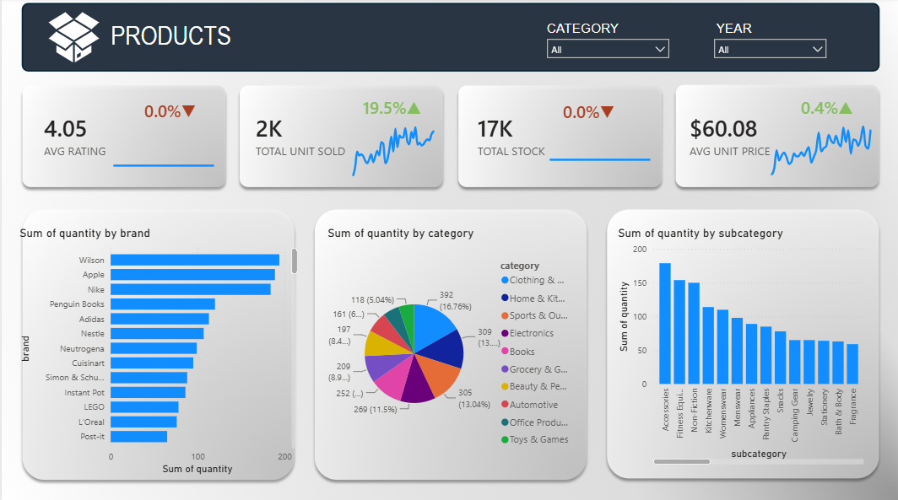
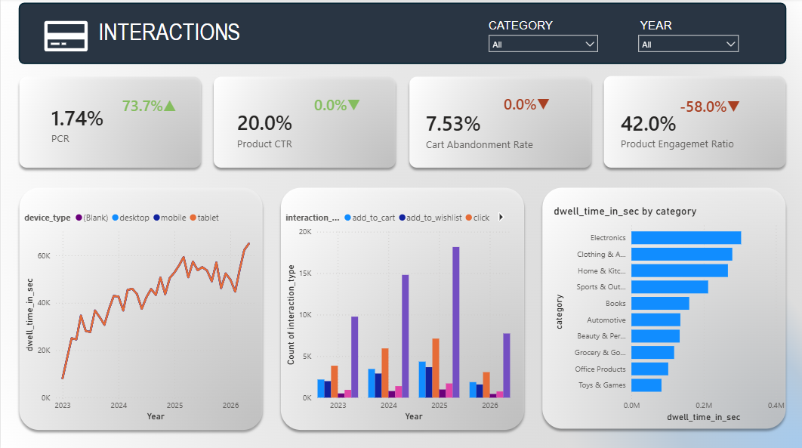

# E-Commerce-Product-Power-BI-Dashboard

Here using data from e-commerce purchasing data, MS Power BI reports were created using robust data modeling and DAX fuctions. Tortal of five report pages were created.

## About the Dataset

Used dataset was originally published on Keggle, which contains six separate datasets, namely “purchases”, “products”, “users”, “sessions”, “interactions” and “reviews”. For this Power BI project, except “reviews” dataset other five datasets were considered. 

The **E-Commerce Product Intelligence Dataset** is a synthetically generated, multi-table relational dataset simulating 3.5 years of customer activity for a mid-size online retailer.

## Dataset Description

| Dataset | Description |
| ------- | ----------- |
| purchases | Purchase order line items derived from cart behavior |
| products | Product catalog with categories, pricing, descriptions, ratings, and inventory |
| users | Customer profiles and demographic attributes |
| sessions | User browsing sessions with device and traffic source information |
| interactions | User-product interaction events across 6 behavior types |

## Variable Description

| Dataset File | Variable Name | Data Type | Key Type | Technical Description |
| :--- | :--- | :---: | :---: | :--- |
| **`users`** | `user_id` | String / UUID | **PK** | Unique identifier for each customer. |
| | `name` | String | - | Full name of the customer. |
| | `email` | String | - | Email address of the customer. |
| | `age` | Integer | - | Age of the user. |
| | `gender` | String | - | Gender identity (e.g., Male, Female, Non-binary). |
| | `country` | String | - | ISO 3166-1 alpha-2 country code of residence. |
| | `income_level` | String | - | Categorized income bracket (`low`, `medium`, `high`, `very_high`). |
| | `loyalty_tier` | String | - | Customer tier classification (`bronze`, `silver`, `gold`, `platinum`). |
| | `created_at` | DateTime | - | Timestamp when the user profile was created. |
| **`products`** | `product_id` | String / UUID | **PK** | Unique identifier for each product catalog item. |
| | `product_name` | String | - | Name of the retail product item. |
| | `category` | String | - | Top-level product vertical (e.g., `Electronics`, `Clothing`). |
| | `subcategory` | String | - | Granular classification nested under the main category. |
| | `brand` | String | - | Manufacturer or brand name of the item. |
| | `price` | Float / Decimal | - | Listed retail price per unit. |
| | `description` | String | - | Text description highlighting product features. |
| | `stock_quantity` | Integer | - | Current inventory units available in warehouses. |
| | `average_rating` | Float | - | Historical aggregated star rating of the product. |
| | `review_count` | Integer | - | Total number of customer reviews submitted for the item. |
| | `created_at` | DateTime | - | Date-time stamp when the product was added to inventory. |
| **`sessions`** | `session_id` | String / UUID | **PK** | Unique identifier for an individual browsing session. |
| | `user_id` | String / UUID | **FK** | Links back to `users.csv`. |
| | `device` | String | - | Hardware channel used (`mobile`, `desktop`, `tablet`). |
| | `referrer_source` | String | - | Marketing attribution source (e.g., `organic_search`, `email`). |
| | `session_start` | DateTime | - | Timestamp when the user initiated browsing activity. |
| | `session_end` | DateTime | - | Timestamp when the browsing activity concluded. |
| **`interactions`** | `interaction_id` | String / UUID | **PK** | Unique record identifier for a micro-behavior event. |
| | `session_id` | String / UUID | **FK** | Links back to `sessions.csv`. |
| | `user_id` | String / UUID | **FK** | Links back to `users.csv`. |
| | `product_id` | String / UUID | **FK** | Links back to `products.csv`. |
| | `interaction_type` | String | - | Action type (`view`, `click`, `add_to_cart`, `add_to_wishlist`, etc.). |
| | `interaction_value` | Float / Varying | - | Associated metric or value multiplier weight if applicable. |
| | `timestamp` | DateTime | - | Exact timestamp when the action occurred. |
| **`purchases`** | `purchase_id` | String / UUID | **PK** | Unique identifier for a checkout transaction order line item. |
| | `user_id` | String / UUID | **FK** | Links back to `users.csv`. |
| | `product_id` | String / UUID | **FK** | Links back to `products.csv`. |
| | `session_id` | String / UUID | **FK** | Links back to `sessions.csv`. |
| | `quantity` | Integer | - | Quantity volume of the item purchased in the order line. |
| | `unit_price` | Float / Decimal | - | Price per unit captured at the exact moment of transaction. |
| | `total_amount` | Float / Decimal | - | Calculated subtotal value (`quantity` × `unit_price`). |
| | `purchase_date` | DateTime | - | Date and time stamp when the payment transaction cleared. |
| | `payment_method` | String | - | Payment gateway channel used (e.g., Credit Card, Digital Wallet). |
| | `shipping_status` | String | - | Lifecycle tracking status of the order line fulfillment. |

## Data Modeling & Architecture

For use of DAX functions, for visualization and for analytics, it is necessary to model the data using relations they inherit. Following figure 1 attached, represents the used data modeling architecture to map the relationship between datasets. This model structure follows the **Star Schema** workflow. 

### Schema Architecture Diagram

*Figure 1: Power BI entity-relationship diagram (ERD) illustrating the relational schema.*

---

### Data Model Component Breakdowns

The model is cleanly organized into **Dimension Tables** (lookup attributes), **Fact Tables** (event streams/transactions), and a dedicated calculation container:

#### 1. Dimension Tables
*   **`users`**: Contains unique demographics data keyed on `user_id`. It acts as a primary filter anchor to analyze buyer habits across different age groups, country codes, and loyalty tiers.
*   **`products`**: House parameters for catalog items keyed on `product_id`. It allows granular slicing by categories, subcategories, price ranges, and brands.
*   **`sessions`**: Captures session metadata keyed on `session_id`. It filters event traffic by acquisition channels (`referrer_source`), hardware platforms (`device_type`), and entry timestamps.

#### 2. Fact Tables
*   **`purchases`**: Holds converted order information, line-item pricing subtotals (`total_amount`), and volumes. This drives the fundamental monetary KPIs throughout the dashboard.
*   **`interactions`**: Tracks granular web clickstream activities (views, card additions, etc.) to evaluate pre-conversion funnel metrics.
*   **`reviews`**: Captures user feedback metrics post-purchase, connecting star values and consumer text directly back to items and specific cohorts.

#### 3. Measure Tables
*   **`DAX Measures`**: Dedicated table for DAX fuctions. This isolates calculations from data structures. This includes metrics like `% YOY ACTIVE USER`, `Previous Year Performances`, `Indications Color` to keep formula editing clean and maintainable.

---

### Cardinality & Relationship Matrix
Necessary relationships were implimented between dataset variables as **One-to-Many ($1:*$)** or **One-to-One ($1:1$)**:

| Source Table (1) | Target Table (*) | Connecting Key | Relationship Type | Cross-Filter Direction |
| :--- | :--- | :---: | :---: | :---: |
| `users` | `purchases` | `user_id` | One-to-Many ($1:*$) | Single |
| `users` | `interactions` | `user_id` | One-to-Many ($1:*$) | Single |
| `users` | `sessions` | `user_id` | One-to-Many ($1:*$) | Single |
| `users` | `reviews` | `user_id` | One-to-Many ($1:*$) | Single |
| `products` | `purchases` | `product_id` | One-to-Many ($1:*$) | Single |
| `products` | `interactions` | `product_id` | One-to-Many ($1:*$) | Single |
| `products` | `reviews` | `product_id` | One-to-Many ($1:*$) | Single |
| `sessions` | `interactions` | `session_id` | One-to-Many ($1:*$) | Single |
| `sessions` | `purchases` | `session_id` | One-to-Many ($1:*$) | Single |

## Dashboard Interface 

### Page 1: Purchases & Sales Performance Overview

*Figure 2: Main interface of the Purchases view dashboard page*

---

### DAX Mesures Description

#### 1. TOTAL SALES
Summates the gross transactional monetary value across all order line items using the `total_amount` field.
$$\text{Total Sales} = \sum (\text{totalamount})$$

```dax
Total Sales = SUM(purchases[total_amount])
```
#### 2. TOTAL QTY
Aggregates the total physical unit volume processed through the checkout using the `quantity` field.
$$\text{Total Qty} = \sum (\text{quantity})$$

```dax
Total Qty = SUM(purchases[quantity])
```

#### 3. AVG UNIT PRICE
Calculates the statistical arithmetic mean of the item clearing prices captured at the exact moment of transaction using the `unitprice` field.  
$$\text{Avg Unit Price} = \overline{\text{unitprice}}$$

```dax
Avg Unit Price = AVERAGE(purchases[unit_price])
```

### Page 2: Products Performance Overview

*Figure 3: Main interface of the Products view dashboard page*

---

### DAX Mesures Description

#### 1. AVG RATING
Calculates the statistical arithmetic mean of user feedback scores across items using the `ratingavg` field.  
$$\text{Avg Rating} = \overline{\text{ratingavg}}$$

```dax
Avg Rating = AVERAGE(products[rating_avg])
```

#### 2. TOTAL UNIT SOLD
Calculates the aggregate frequency of transactional line items processed by counting rows via the `productid` attribute.  
$$\text{Total Units Sold} = \text{Count}(\text{productid})$$

```dax
Total Unit Sold = COUNT(purchases[product_id])
```

#### 6. TOTAL STOCK
Calculates the absolute static warehouse inventory capacity across the entire catalog by overriding active filters using the `stock\_quantity` field.  
$$\text{Total Stock} = \sum_{\text{All Products}} (\text{stockquantity})$$

```dax
Total Stock = CALCULATE(SUM(products[stock_quantity]), ALL(products))
```

### Page 3: Interaction Performance Overview

*Figure 2: Main interface of the Interaction view dashboard page*

---

### DAX Mesures Description

#### 1. PCR (Purchase Conversion Rate)
Calculates the macro-level funnel conversion rate by dividing total purchase events by total micro-behavior product interactions.  
$$\text{PCR} = \frac{\text{Count}(\text{purchase productid})}{\text{Count}(\text{interaction productid})}$$

```dax
PCR = DIVIDE(COUNT(purchases[product_id]), COUNT(interactions[product_id]), 0)
```

#### 2. CTR (Product Click-Through Rate)
Calculates the proportion of total product interactions that resulted in an explicit click action by isolating "click" events through a conditional filter variable.  
$$\text{Product CTR} = \frac{\text{Count}(\text{interactiontype} = \text{"click"})}{\text{Total Count}(\text{interactiontype})}$$

```dax
Product CTR = 
VAR click_counts = CALCULATE(COUNT(interactions[interaction_type]), 
                            interactions[interaction_type] == "click")
VAR total_interactions = COUNT(interactions[interaction_type])
RETURN
DIVIDE(click_counts, total_interactions, 0)
```

#### 3. Cart Abandonment Rate
Calculates the proportion of intent signals that resulted in a reduction or abandonment of an item from the cart or wishlist, measured against total behavioral interaction footprints.  
$$\text{Cart Abandonment Rate} = \frac{\text{Count}(\text{interactiontype} = \text{"removefromcart"} \text{ or } \text{"removefromwishlist"})}{\text{Total Count}(\text{interactionid})}$$

```dax
Cart Abandonment Rate = 
VAR cart_aband_count = CALCULATE(COUNT(interactions[interaction_type]), 
                                interactions[interaction_type] == "remove_from_wishlist" || interactions[interaction_type] == "remove_from_cart")
VAR total_views = COUNT(interactions[interaction_id])
RETURN
DIVIDE(cart_aband_count, total_views, 0)
```

#### 4. Product Engagement Ratio
Calculates the proportion of passive discovery interactions that successfully converted into high-intent actions (such as clicks, cart additions, or wishlist saves) against total logged interaction footprints.  
$$\text{Product Engagement Ratio} = \frac{\text{Count}(\text{interactiontype} \in \{\text{"click"}, \text{"addtocart"}, \text{"addtowishlist"}\})}{\text{Total Count}(\text{interactionid})}$$

```dax
Product Engagement Ratio = 
VAR engagment_count = CALCULATE(COUNT(interactions[interaction_type]), 
                                interactions[interaction_type] == "click" ||  interactions[interaction_type] == "add_to_cart" || interactions[interaction_type] == "add_to_wishlist")
VAR total_views = COUNT(interactions[interaction_id])
RETURN
DIVIDE(engagment_count, total_views, 0)